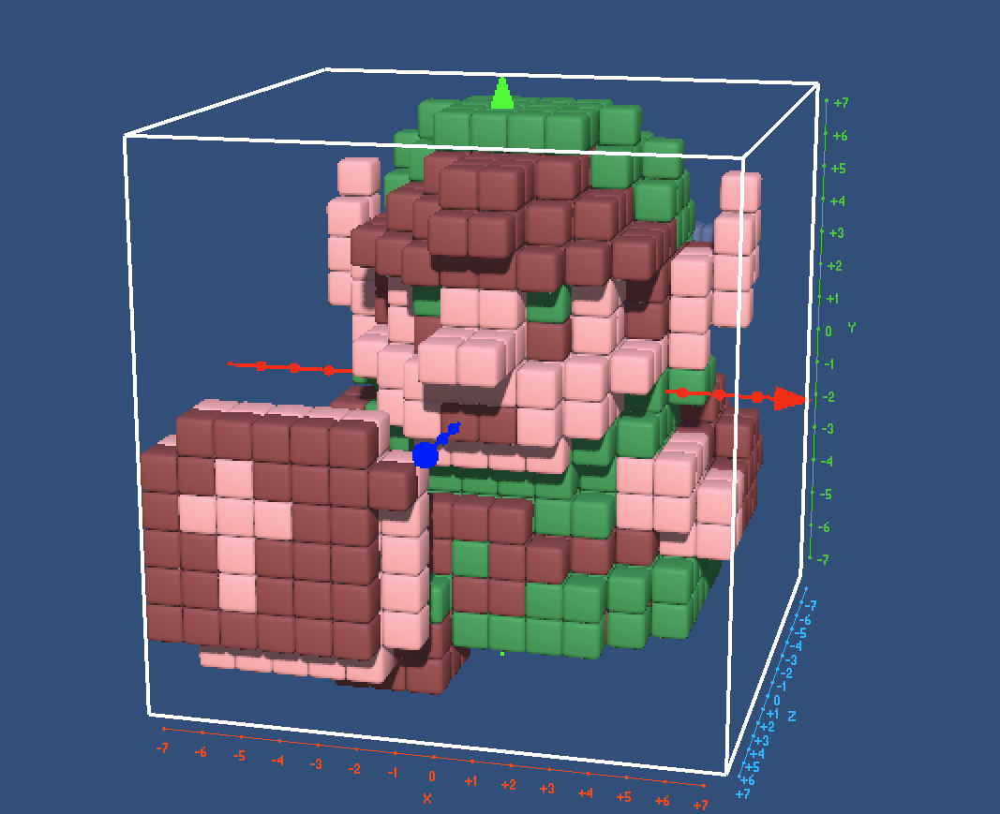
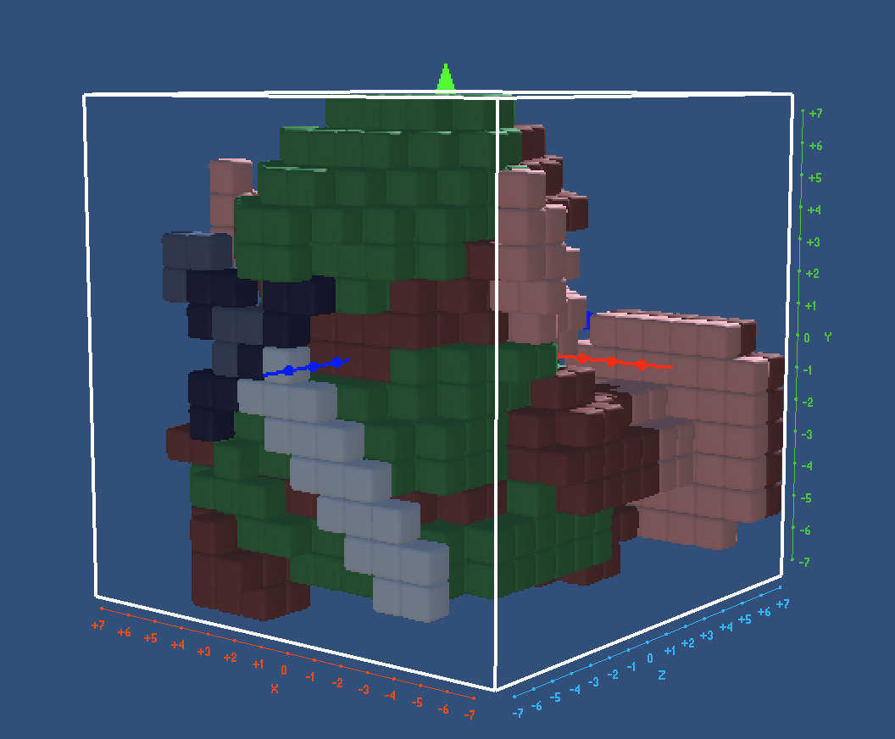
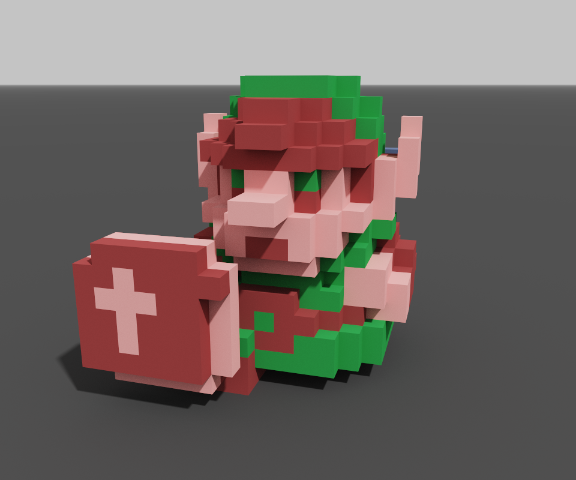
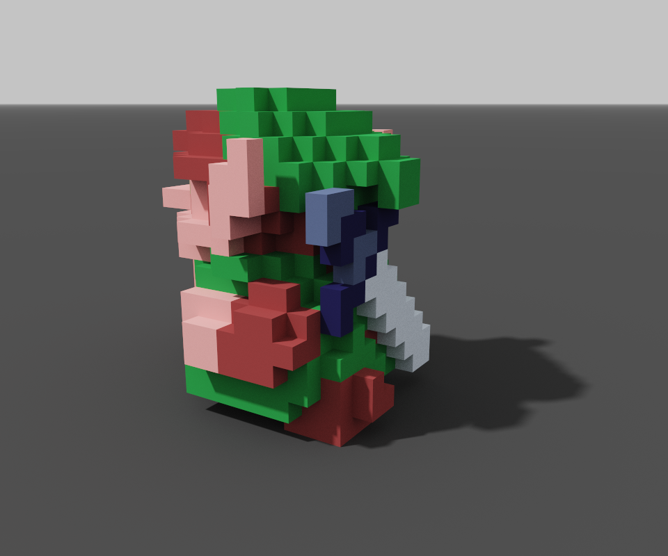

# Replicube game solutions

## Description

Solutions to puzzles/challenges from the videogame [Replicube](https://store.steampowered.com/app/3401490/Replicube/), which you code in Lua.

Generally optimizing for code size, not for cycles, but not going crazy either. When I finish all the puzzles I might try to go for more insane optimizations. I'm keeping my optimization and "coding techniques" [in this file](coding.md).

Notes:

- I have not yet finished all the game's challenges

## Extra: My Sandbox Projects

Some personal projects, exported in `.vox` format, compatible with the [MagicaVoxel](https://ephtracy.github.io/) tool (from where the higher quality renders come from).

You can also view the Voxel 3D models using [this online viewer](https://kartones.net/demos/033/).

