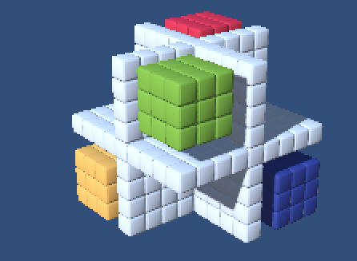
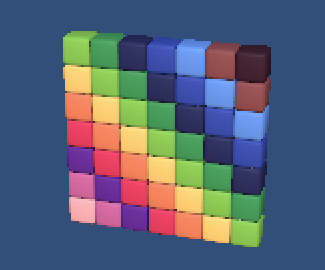
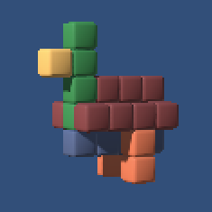

## Replicube game solutions

Solutions to puzzles/challenges from the videogame [Replicube](https://store.steampowered.com/app/3401490/Replicube/), which you code in Lua.

Generally optimizing for code size, not for cycles, but not going crazy either. When I finish all the puzzles I might try to go for more insane optimizations.

Notes:

- I have not yet finished all the game's challenges
